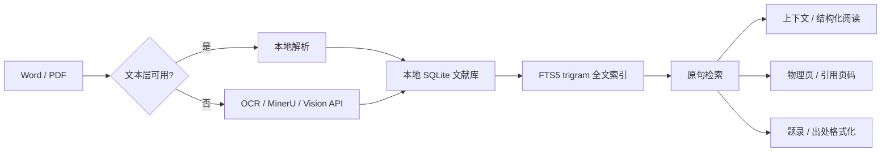

<p align="center">
  
</p>

<h1 align="center">MEFinder</h1>

<p align="center"><strong>写论文时，找回原句，也核对引文。</strong></p>

<p align="center">MEFinder 帮你回到文献、上下文和页码。</p>

<p align="center">
  本地优先的 PDF / Word 文献检索、页码定位与引文辅助工具
</p>

<p align="center">
  <a href="https://github.com/sabercomo/MEFinder/stargazers"></a>
  <a href="https://github.com/sabercomo/MEFinder/releases/latest"></a>
  <a href="https://github.com/sabercomo/MEFinder/releases"></a>
  <a href="LICENSE"></a>
  <a href="#下载"></a>
  <a href="#下载"></a>
</p>

<p align="center">
  <a href="https://github.com/sabercomo/MEFinder/releases/latest">🚀 下载最新版</a>
  · <a href="#快速开始">📖 快速开始</a>
  · <a href="docs/MCP_CLIENT_SETUP.md">🔌 MCP 配置</a>
  · <a href="#主要功能">✨ 主要功能</a>
  · <a href="#工作原理">⚙️ 工作原理</a>
</p>

<p align="center">
  
</p>

## 为什么做 MEFinder？

我是一名在读文科硕士生。以前写小论文，每到定稿前，都要把正文里的引文一条条重新核对：原文有没有抄错，出处有没有写对，页码准不准，我对上下文的理解有没有偏差。写作的时候，我也常常明明记得某个观点、某段大意，却一时想不起原句到底怎么写、藏在哪份文献里。

现在写大论文，文献更多了。我常常要在好几个 PDF 之间来回切换，反复打开、搜索、翻页、核对。被这些麻烦反复折腾之后，我开始想：如果有一个工具，能把自己的文献都放在一起，既能凭记得的片段找回原句，也能根据论文里的引文找到出处、上下文和页码，会不会省下很多时间？

我找了一圈，没发现真正贴合这种需求的软件，于是决定自己动手做一个。MEFinder 就这样开始了。

无论你交给它的是完整的原句、残缺的片段，还是带着错字漏字的只言片语，它都会在你的本地文献库里找回原文，带你回到上下文和原始页面，并把出处整理好，方便你继续核对、复制。

它不会替你“猜”引文来自哪里，也不会编一个像模像样的答案来糊弄你。搜索、索引、页码映射和大部分元数据处理，默认都在本机完成；只有扫描件、文本层乱码或版面复杂的 PDF 确实需要解析时，才由你决定是否交给 MinerU 或其他视觉服务。

这也是我第一次完整地做完一个软件项目，一路上磕磕绊绊，很多东西都是边做边学，MEFinder 也还在继续完善。如果它没找到你确定存在的句子，或者页码、题录处理得不对，欢迎附上具体样例来提交 Issue。感谢大家愿意试用，不足之处还请多多包涵。

如果 MEFinder 恰好能帮你少翻几次 PDF、少花点核对引文的时间，欢迎顺手点个 Star 🌟。对第一次做开源项目的我来说，你的支持会是很大的鼓励，也会让我更有动力继续把它做好。

<a id="主要功能"></a>

## ✨ 主要功能

| 功能 | 能做什么 |
| --- | --- |
| **原句定位** | 输入完整原句、残句或带少量错字、漏字的文本，通过自动、精确、忽略空格、忽略标点和模糊模式定位原文。 |
| **上下文 / 页码定位** | 查看命中位置的前后文，区分 PDF 物理页与书内引用页码；支持自动映射和人工分段校准。 |
| **PDF / Word / 扫描件** | 原生 Word 和文本型 PDF 在本机解析；扫描版、乱码文本层与复杂布局 PDF 可按需接入 MinerU 或视觉模型。 |
| **繁体竖排 / 外部解析结果** | 可继续检索已经由 OCR、MinerU 或其他工具解析的繁体竖排、影印本等材料，并结合页码信息定位。 |
| **结构化阅读** | 从搜索结果直接打开结构化文本，查看命中段落、相邻内容与原始 PDF 页面。 |
| **题录补全 / 五种出处格式** | 识别并补全图书、译著、期刊和学位论文题录；支持中文脚注、GB/T 7714、APA、MLA、Chicago。 |
| **文档包传输** | 把已入库 PDF 连同页级文本、书目和页码映射导出为 `.mefinder.zip`，换设备后重新导入即可恢复，不用重新 OCR。 |

<a id="适合什么场景"></a>

## 🎯 适合什么场景

- 写论文时只记得一句话，却忘了出自哪本书、哪一页；
- AI 给的引文、笔记或文档里摘的句子，想回到原文确认一下；
- 本地攒了一堆 PDF / Word，不想一本本打开挨个 `Ctrl + F`；
- 扫描书、影印本、繁体竖排材料已经做过 OCR，希望统一检索；
- 搜到原句后还想接着看上下文、翻到原页、顺手复制规范出处；
- PDF 的“第 48 页”实际对应书内“第 1 页”，需要分别管理物理页与引用页码。

<a id="工作原理"></a>

## ⚙️ 工作原理



MEFinder 使用本地 SQLite 数据库和 FTS5 trigram 全文索引保存来源、文献、段落、原始文本与页码映射。搜索时不需要向量数据库、Embedding 或 LLM API。

原生文本 PDF 优先由 PyMuPDF 读取，Word 文献走本地解析。只有扫描版、乱码文本层或复杂布局 PDF 需要 OCR / 视觉解析；只有你主动使用在线解析时，待处理的页面才会被上传。

页码系统同时保留 PDF 物理页与正式引用页码。自动映射无法可靠判断时，可以人工分段校准；没校准过的页码不会被当成正式引用页码。

<a id="下载"></a>

## ⬇️ 下载

正式发布包均位于 [GitHub Releases](https://github.com/sabercomo/MEFinder/releases/latest)，普通用户不需要安装 Python。

| 平台 | 版本 | 发布包 |
| --- | --- | --- |
| **Windows** | 安装版（推荐） | `MEFinder-v<版本>-windows-setup.exe` |
| **Windows** | 绿色免安装版 | `MEFinder-v<版本>-windows-portable.zip` |
| **macOS** | Apple Silicon | `MEFinder-v<版本>-macos-arm64.dmg` |
| **macOS** | Intel | `MEFinder-v<版本>-macos-x86_64.dmg` |

### Windows

- 支持 Windows 10 21H2 及以上系统；
- 安装版支持应用内检查更新，用户数据默认保存在 `%LOCALAPPDATA%\MEFinder`；
- 绿色版完整解压后双击 `文献原句定位器.exe`，程序、文献、索引、设置和日志均保存在解压目录；
- 未签名的发布包可能触发 Windows SmartScreen 提示。

### macOS

- Apple Silicon（`arm64`）支持 macOS 14 或更高版本；
- Intel（`x86_64`）支持 macOS 12 或更高版本；
- 根据 Mac 芯片选择 Apple Silicon（`arm64`）或 Intel（`x86_64`）DMG；
- 打开 DMG 后将 `MEFinder.app` 拖入 `Applications`；
- 应用数据保存在 `~/Library/Application Support/MEFinder/`。

<a id="快速开始"></a>

## 📖 快速开始

1. **导入文献**
   打开左侧“文献导入”，选择或拖入 PDF / Word。原生文本文件会直接进入本地索引；扫描、乱码或复杂布局 PDF 会提示选择解析方式。

2. **搜索原句**
   输入完整句子或片段，选择综合、精确或模糊检索，也可以限定 Word、PDF 或指定文献范围。

3. **查看原文**
   在结果中查看命中内容与上下文，打开结构化文本，或跳转到原始 PDF 的对应物理页。

4. **校准引用页码**
   如果 PDF 封面、目录等导致物理页与书内页码不一致，可建立分段映射。例如：

   ```text
   PDF 起始页：48
   引用起始页：1
   ```

5. **复制出处**
   选择中文脚注、GB/T 7714、APA、MLA 或 Chicago，然后复制当前文献的规范出处。关键元数据或页码缺失时，程序会明确提示。

### 配置 MinerU API（可选）

扫描版、乱码文本层或复杂排版 PDF 会交给 MinerU 在线解析。先到 [MinerU 申请 API Token](https://mineru.net/apiManage/token)（先登录，再申请）拿到 Token，再到软件里填：

1. 打开 **设置 → MinerU API**，进去就是填写表单，其他保持默认即可；
2. 把申请到的 **API Token** 粘贴进输入框；
3. **到期日期**选填，拿不准就留空。建议填上：免费 Key 一般只有三个月有效期，填了以后账号列表里会显示剩余天数，过期了也看得出来；
4. 点 **保存配置**；
5. 保存后账号出现在列表里，点 **测试**，显示连接成功就行。

导入扫描 PDF 时选 **强制 MinerU**，或者保留默认的 **自动选择**——文字层不可靠时程序会自动改用 MinerU。

不想用 MinerU 的话，也能在 **设置 → 其他解析 API** 里添加 OpenAI 兼容的视觉模型或中转接口，导入时选 **其他视觉 API**。

### 文档包导出 / 导入（0.4.4）

解析结果可以随身带走，换台电脑也不用重新 OCR：

- **导出**：选中一本或多本已入库 PDF，在设置 → 文档传输里选择“仅文档数据”（页级文本、书目、页码映射，文件小）或“文档包＋原 PDF”（跨设备推荐，导入后可直接打开原文），导出为 `.mefinder.zip`。当前版本不导出 Word，批量操作会跳过 Word 文献。
- **导入**：把 `.mefinder.zip` 拖进导入页即可，程序会恢复书目、页码和索引；包内含原 PDF 时一并恢复，不需要重新解析。
- **完整性校验**：包内原 PDF 会核对大小和 SHA-256；校验不一致时拒绝恢复该 PDF。文档包未做数字签名，不能据此判断来源真实性。

### MCP 文献核对（0.4.4，可选只读集成）

0.4.4 提供三个本地只读 MCP 工具（`list_documents`、`locate_quote`、`read_document_window`），让 AI 助手直接读你的文献库：列出已导入文献、定位原句、继续读命中位置的上下文。Windows 安装版、绿色版和 macOS 发布包都包含独立 `MEFinderMCP` sidecar，不用装 Python；源码模式也可单独接入。桌面窗口无需保持开启，MCP 进程本身不联网。

需要选择的是 `MEFinderMCP.exe`，不是桌面主程序。Windows 安装版通常位于：

```text
C:\Users\<你的用户名>\AppData\Local\Programs\MEFinder\MEFinderMCP.exe
```

绿色版则用解压目录里的 `MEFinderMCP.exe`，例如 `D:\MEFinder\MEFinderMCP.exe`。它走本地 **STDIO** 协议，不用手动双击，客户端会自动启动它。

#### Codex（Windows）

打开 **设置 → 插件 → MCP → 添加 → 添加 MCP 服务器**，填写：

| 项目 | 内容 |
| --- | --- |
| 名称 | `mefinder` |
| 类型 | `STDIO` |
| 启动命令 | `MEFinderMCP.exe` 的完整路径 |
| 参数、环境变量 | 留空 |
| 工作目录 | `MEFinderMCP.exe` 所在文件夹 |

保存后重启或重新加载 MCP，然后让 Codex 试试，比如说：“请只使用 mefinder 搜索这句话来自哪篇文献、哪一页。”

#### Claude Code（Windows）

打开 PowerShell（按 `Win + R` 输入 `powershell` 回车），粘贴下面这条命令，把路径换成自己的：

```powershell
claude mcp add --transport stdio --scope user mefinder -- "D:\MEFinder\MEFinderMCP.exe"
claude mcp list
```

#### WorkBuddy（Windows）

进入 WorkBuddy 后，打开：

**插件 → MCP 服务器 → 配置 MCP**

WorkBuddy 会打开它正在用的配置文件，在 `mcpServers` 里加上：

```json
{
  "mcpServers": {
    "mefinder": {
      "type": "stdio",
      "command": "D:\\MEFinder\\MEFinderMCP.exe",
      "args": []
    }
  }
}
```

`command` 里的路径换成你电脑上 `MEFinderMCP.exe` 的实际位置。

Windows 普通路径写成：

```text
D:\MEFinder\MEFinderMCP.exe
```

但在 JSON 字符串中，每个反斜杠需要写两次：

```text
D:\\MEFinder\\MEFinderMCP.exe
```

Windows 的完整操作、macOS 三客户端配置和常见错误见 [Windows/macOS MCP 配置教程](docs/MCP_CLIENT_SETUP.md)；源码模式和 Codex 高级排错见 [Codex MCP 配置、健康检查与隐私说明](docs/CODEX_MCP.md)。返回给 AI 的命中原文和上下文会进入相应客户端的对话及模型上下文，涉及未公开文献时请留意。

<a id="已知限制"></a>

## ⚠️ 已知限制

- 导入按固定大小分块进行，不限制单个文件总大小；超大型 PDF 会按解析服务能力切片处理；
- 纯扫描、乱码文本层和复杂排版 PDF 依赖 OCR / AI 解析，检索质量受上游结果影响；
- 原书没有印刷页码时，可以定位 PDF 物理页，但不会生成不存在的书内页码；
- DOCX 页码依赖文档分节和页面结构，导入后建议人工抽样核验；
- 旧版二进制 DOC 的页码精度有限，部分情况下只能显示目录页码范围；
- 未校准的 PDF 会显示“引用页码尚未校准”，不会用 PDF 页序冒充正式页码；
- 跨页搜索通过相邻页窗口实现，结果会返回起始页和结束页；
- MinerU 和其他在线视觉解析依赖网络与有效凭据，本地搜索和索引不依赖这些服务。

<a id="roadmap"></a>

## 🗺️ Roadmap

- 提升超大型 PDF 导入、断点恢复与异常重试能力；
- 继续优化繁体竖排、双开页和复杂版面的页码定位；
- 扩展题录数据源与不同文献类型的自动补全能力；
- 继续完善引用核验、结构化阅读和批量资料管理；
- 持续改进 Windows / macOS 安装、签名和自动更新流程。

Roadmap 表示当前改进方向，不代表固定发布日期；实际进度以 [版本记录](docs/RELEASE_NOTES.md) 和 Releases 为准。

<a id="开发与构建"></a>

## 🛠️ 开发与构建

源码模式需要 Python 3；PDF 原生文本解析推荐安装 PyMuPDF。

```bash
python3 -m pip install PyMuPDF
python3 -m src.me_finder build-index --include-pdf
python3 -m src.me_finder serve --host 127.0.0.1 --port 8765
```

运行测试：

```bash
python3 -m unittest discover
```

构建与发布文档：

- [Windows 构建与发布](docs/WINDOWS_BUILD.md)
- [macOS 构建与发布](docs/MACOS_BUILD.md)
- [版本记录](docs/RELEASE_NOTES.md)

## 许可证

MEFinder 自有代码依据 GNU Affero General Public License Version 3 only
发布（`SPDX-License-Identifier: AGPL-3.0-only`）。完整条款见 [LICENSE](LICENSE)，
发行包内第三方组件的许可证见 [THIRD_PARTY_NOTICES.txt](THIRD_PARTY_NOTICES.txt)。

## 隐私

- 本地搜索、索引和页码映射等功能默认只在用户本机进行。
- 只有用户主动配置并调用 MinerU、视觉 API 或其他联网功能时，相关数据才会发送到用户所选择的第三方服务。
- API 密钥保存在本地，不随安装包分发。
- 第三方服务受各自隐私政策约束。

---

MEFinder 的目标很简单：**让“我记得这句话，但我忘了它在哪”不再变成翻几十本书的体力活。**
