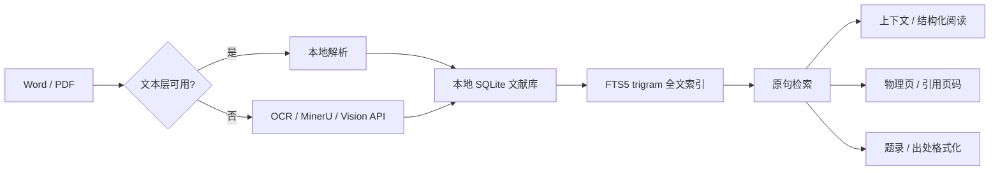

<p align="center">
  
</p>

<h1 align="center">MEFinder</h1>

<p align="center"><strong>从一句原文，定位到文献、上下文和页码。</strong></p>

<p align="center">
  本地优先的 Word / PDF 文献检索、页码定位与引文辅助工具
</p>

<p align="center">
  <a href="https://github.com/sabercomo/MEFinder/releases/latest">下载最新版</a>
  · <a href="#主要功能">主要功能</a>
  · <a href="#快速开始">快速开始</a>
  · <a href="#工作原理">工作原理</a>
</p>

MEFinder 面向论文写作、文献阅读和资料核对场景。输入完整原句、片段，甚至带少量错漏的文字，即可从本地文献库中找回对应文献，继续查看上下文、定位原页、校准引用页码，并复制规范出处。

它不依赖大模型“猜出处”。搜索、索引、页码映射和大部分元数据处理默认都在本机完成；只有扫描件、乱码文本层和复杂版面材料需要在你主动选择后交给 MinerU 或其他视觉解析服务。

<p align="center">
  
</p>

<a id="主要功能"></a>

## ✨ 主要功能

| 功能 | 能做什么 |
| --- | --- |
| **原句定位** | 输入完整原句、残句或带少量错字、漏字的文本，通过自动、精确、忽略空格、忽略标点和模糊模式定位原文。 |
| **上下文 / 页码定位** | 查看命中位置的前后文，区分 PDF 物理页与书内引用页码；支持自动映射和人工分段校准。 |
| **PDF / Word / 扫描件** | 原生 Word 和文本型 PDF 在本机解析；扫描版、乱码文本层与复杂布局 PDF 可按需接入 MinerU 或视觉模型。 |
| **繁体竖排 / 外部解析结果** | 可继续检索已经由 OCR、MinerU 或其他工具解析的繁体竖排、影印本等材料，并结合页码信息定位。 |
| **结构化阅读** | 从搜索结果直接打开结构化文本，查看命中段落、相邻内容与原始 PDF 页面。 |
| **题录补全 / 五种出处格式** | 识别并补全图书、译著、期刊和学位论文题录；支持中文脚注、GB/T 7714、APA、MLA、Chicago。 |

<a id="适合什么场景"></a>

## 🎯 适合什么场景

- 写论文时只记得一句话，却忘了出自哪本书、哪一页；
- AI、笔记或旧文档里留下一段引用，需要回到原文核对；
- 本地积累了大量 PDF / Word，不想逐本打开再 `Ctrl + F`；
- 扫描书、影印本、繁体竖排材料已经做过 OCR，希望统一检索；
- 搜到原句以后，希望继续看上下文、打开原页并复制规范出处；
- PDF 的“第 48 页”实际对应书内“第 1 页”，需要分别管理物理页与引用页码。

<a id="工作原理"></a>

## ⚙️ 工作原理



MEFinder 使用本地 SQLite 数据库和 FTS5 trigram 全文索引保存来源、文献、段落、原始文本与页码映射。搜索时不需要向量数据库、Embedding 或 LLM API。

原生文本 PDF 优先由 PyMuPDF 读取，Word 文献走本地解析。只有扫描版、乱码文本层或复杂布局 PDF 需要 OCR / 视觉解析；在线解析路径仅在用户主动使用时上传待处理页面。

页码系统同时保留 PDF 物理页与正式引用页码。自动映射无法可靠判断时，可以人工分段校准；未验证的页码不会被伪装成精确引用页码。

<a id="下载"></a>

## ⬇️ 下载

正式发布包均位于 [GitHub Releases](https://github.com/sabercomo/MEFinder/releases/latest)，普通用户不需要安装 Python。

代码签名、团队角色和隐私说明见 [Code signing policy](#code-signing-policy)。

| 平台 | 版本 | 发布包 |
| --- | --- | --- |
| **Windows** | 安装版（推荐） | `MEFinder-v<版本>-windows-setup.exe` |
| **Windows** | 绿色免安装版 | `MEFinder-v<版本>-windows-portable.zip` |
| **macOS** | Apple Silicon | `MEFinder-v<版本>-macos-arm64.dmg` |
| **macOS** | Intel | `MEFinder-v<版本>-macos-x86_64.dmg` |

### Windows

- 支持 Windows 10 21H2 及以上系统；
- 安装版支持应用内检查更新，用户数据默认保存在 `%LOCALAPPDATA%\MEFinder`；
- 绿色版完整解压后双击 `文献原句定位器.exe`，程序、文献、索引、设置和日志均保存在解压目录；
- 未签名的发布包可能触发 Windows SmartScreen 提示。

### macOS

- 支持 macOS 14 或更高版本；
- 根据 Mac 芯片选择 Apple Silicon（`arm64`）或 Intel（`x86_64`）DMG；
- 打开 DMG 后将 `MEFinder.app` 拖入 `Applications`；
- 应用数据保存在 `~/Library/Application Support/MEFinder/`。

<a id="快速开始"></a>

## 📖 快速开始

1. **导入文献**
   打开左侧“文献导入”，选择或拖入 PDF / Word。原生文本文件会直接进入本地索引；扫描、乱码或复杂布局 PDF 会提示选择解析方式。

2. **搜索原句**
   输入完整句子或片段，选择综合、精确或模糊检索，也可以限定 Word、PDF 或指定文献范围。

3. **查看原文**
   在结果中查看命中内容与上下文，打开结构化文本，或跳转到原始 PDF 的对应物理页。

4. **校准引用页码**
   如果 PDF 封面、目录等导致物理页与书内页码不一致，可建立分段映射。例如：

   ```text
   PDF 起始页：48
   引用起始页：1
   ```

5. **复制出处**
   选择中文脚注、GB/T 7714、APA、MLA 或 Chicago，然后复制当前文献的规范出处。关键元数据或页码缺失时，程序会明确提示。

<a id="已知限制"></a>

## ⚠️ 已知限制

- 单个导入文件上限为 **600 MB**；超大型 PDF 的导入速度和恢复能力仍在优化；
- 纯扫描、乱码文本层和复杂排版 PDF 依赖 OCR / AI 解析，检索质量受上游结果影响；
- 原书没有印刷页码时，可以定位 PDF 物理页，但不会生成不存在的书内页码；
- DOCX 页码依赖文档分节和页面结构，导入后建议人工抽样核验；
- 旧版二进制 DOC 的页码精度有限，部分情况下只能显示目录页码范围；
- 未校准的 PDF 会显示“引用页码尚未校准”，不会用 PDF 页序冒充正式页码；
- 跨页搜索通过相邻页窗口实现，结果会返回起始页和结束页；
- MinerU 和其他在线视觉解析依赖网络与有效凭据，本地搜索和索引不依赖这些服务。

<a id="roadmap"></a>

## 🗺️ Roadmap

- 提升超大型 PDF 导入、断点恢复与异常重试能力；
- 继续优化繁体竖排、双开页和复杂版面的页码定位；
- 扩展题录数据源与不同文献类型的自动补全能力；
- 完善引用核验、结构化阅读与批量资料管理体验；
- 持续改进 Windows / macOS 安装、签名和自动更新流程。

Roadmap 表示当前改进方向，不代表固定发布日期；实际进度以 [版本记录](docs/RELEASE_NOTES.md) 和 Releases 为准。

<a id="开发与构建"></a>

## 🛠️ 开发与构建

源码模式需要 Python 3；PDF 原生文本解析推荐安装 PyMuPDF。

```bash
python3 -m pip install PyMuPDF
python3 -m src.me_finder build-index --include-pdf
python3 -m src.me_finder serve --host 127.0.0.1 --port 8765
```

运行测试：

```bash
python3 -m unittest discover
```

构建与发布文档：

- [Windows 构建与发布](docs/WINDOWS_BUILD.md)
- [macOS 构建与发布](docs/MACOS_BUILD.md)
- [版本记录](docs/RELEASE_NOTES.md)

## 许可证

MEFinder 自有代码依据 GNU Affero General Public License Version 3 only
发布（`SPDX-License-Identifier: AGPL-3.0-only`）。完整条款见 [LICENSE](LICENSE)，
发行包内第三方组件的许可证见 [THIRD_PARTY_NOTICES.txt](THIRD_PARTY_NOTICES.txt)。

## Code signing policy

Free code signing provided by SignPath.io, certificate by SignPath Foundation

### Team roles

- Committers and reviewers: sabercomo
- Approvers: sabercomo

### Privacy

- 本地搜索、索引和页码映射等功能默认只在用户本机进行。
- 只有用户主动配置并调用 MinerU、视觉 API 或其他联网功能时，相关数据才会发送到用户所选择的第三方服务。
- API credentials 存储在本地，不随发行包分发。
- 第三方服务受各自隐私政策约束。

---

MEFinder 的目标很简单：**让“我记得这句话，但我忘了它在哪”不再变成翻几十本书的体力活。**
