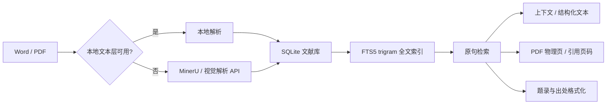

<p align="center">
  
</p>

<h1 align="center">MEFinder · 文献原句定位器</h1>

<p align="center"><strong>从一句原文，定位到文献、上下文和页码。</strong></p>

<p align="center">本地优先的 Word / PDF 文献检索、页码定位与引文辅助工具</p>

<p align="center">
  <a href="https://github.com/sabercomo/MEFinder/releases/latest">下载最新版</a>
  · <a href="#主要功能">主要功能</a>
  · <a href="#下载与安装">下载与安装</a>
  · <a href="#工作原理">工作原理</a>
</p>

---

MEFinder 面向论文写作、文献阅读和资料核对场景。你可以输入完整原句、片段，甚至带少量错漏的文字，从本地文献库中快速找回对应文献，并继续查看上下文、定位原页、核对页码、打开结构化文本和复制规范出处。

它不是一个只能按文件名检索 PDF 的管理器，也不是依赖大模型“猜出处”的问答工具。搜索、索引、页码映射和大部分元数据处理默认都在本机完成；扫描件、乱码文本层和复杂版面材料则可以按需接入 MinerU 或其他视觉解析服务。

## 主要功能

| 功能 | 能做什么 |
| --- | --- |
| **原句定位** | 输入完整原句、残句或带少量错字/漏字的文本，快速定位对应文献。支持自动、精确、忽略空格、忽略常见标点、模糊匹配等模式。 |
| **上下文与结构化阅读** | 搜到一句话后继续查看前后文，并可打开结构化文本阅读器查看命中位置。 |
| **页码定位与校准** | 区分 PDF 物理页与书内引用页码；支持自动页码映射和人工分段校准，避免把 PDF 页序误当成正式引用页码。 |
| **Word / PDF 统一检索** | 原生 Word、原生文本 PDF 可直接本地解析并进入同一索引；文献库可按来源、文件和文献范围筛选。 |
| **扫描件与复杂 PDF** | 扫描版、乱码文本层、复杂布局 PDF 可接入 MinerU；也可配置兼容 OpenAI Chat Completions 的视觉模型接口作为备用解析路径。 |
| **繁体竖排与外部 OCR 材料** | 对已经由 MinerU 或其他 OCR / AI 工具解析出的繁体竖排、影印本等材料，可继续在 MEFinder 中检索并结合页码信息定位。 |
| **题录识别与补全** | 对图书、译著、期刊、学位论文等文献元数据进行识别，并在需要时使用联网数据源辅助补全。 |
| **规范出处复制** | 支持 **中文脚注、GB/T 7714、APA、MLA、Chicago**。选择格式后直接复制当前文献的出处信息。 |
| **本地优先** | 搜索不依赖向量数据库、Embedding 或 LLM API；不开启在线解析时，原句检索本身无需把文献上传到第三方。 |

## 适合什么场景

- 写论文时只记得一句话，却忘了出自哪本书、哪一页；
- AI、笔记或旧文档里留下了一段引用，需要回到原文核对；
- 本地积累了大量 PDF / Word，不想逐本打开再 `Ctrl + F`；
- 扫描书、影印本、繁体竖排材料已经做过 OCR，希望统一检索；
- 搜到原句以后，希望继续查看上下文、打开原页，并直接获得可复制的规范出处；
- PDF 的“第 48 页”实际对应书内“第 1 页”，需要把物理页与正式引用页码分开管理。

## 一个典型工作流

1. **导入文献**：把 Word 或 PDF 加入文献库。
2. **建立索引**：原生文本直接本地解析；扫描或复杂 PDF 可按需交给 MinerU / 视觉模型解析。
3. **搜索原句**：输入完整句子、片段或存在少量错漏的文本，按全部文献、来源类型或指定文件检索。
4. **回到原文**：查看命中上下文、结构化文本，并跳到对应 PDF 物理页或校准后的引用页码。
5. **复制出处**：在中文脚注、GB/T 7714、APA、MLA、Chicago 中选择格式，然后复制题录/出处。

## 工作原理



MEFinder 的检索核心是本地 SQLite 数据库与 FTS5 trigram 全文索引。索引中保存来源、卷次、文献、段落、页码映射、原始文本与规范化检索字段，因此搜索时不需要把句子转换成向量，也不需要调用大模型判断“这句话可能来自哪里”。

对于原生文本 PDF，程序优先使用 PyMuPDF 读取文本；Word 文献走本地解析。只有扫描版、乱码文本层或复杂布局 PDF 需要额外的 OCR / 视觉解析。MinerU 是默认解析路径，也可以配置其他兼容视觉接口；这些在线路径只在用户主动使用时上传待解析页面。

页码系统同时保留 PDF 物理页和正式引用页码。自动映射无法可靠判断时，可以人工分段校准；未验证的页码不会被伪装成精确引用页码。

## 下载与安装

所有正式发布包都在 [Releases](https://github.com/sabercomo/MEFinder/releases/latest)。普通用户不需要安装 Python。

### Windows

#### 安装版（推荐）

下载：

```text
MEFinder-v<版本>-windows-setup.exe
```

安装版适合日常长期使用，支持应用内检查更新。程序文件默认安装到 `%LOCALAPPDATA%\Programs\MEFinder`，文献、索引、设置和更新缓存保存在 `%LOCALAPPDATA%\MEFinder`；覆盖安装和正常升级不会删除用户数据。

Windows 默认使用应用内 Edge WebView2 阅读窗口打开 PDF，并跳到搜索命中的物理页；也可以在设置中切换为系统默认 PDF 阅读器。

> 当前发布包如果未做代码签名，Windows SmartScreen 可能显示安全提示。

#### 绿色免安装版

下载：

```text
MEFinder-v<版本>-windows-portable.zip
```

完整解压后双击 `文献原句定位器.exe` 即可使用。绿色版支持 Windows 10 21H2 及以上系统，程序、文献、索引、设置和日志都保存在解压目录，适合移动使用或不希望安装软件的场景。

### macOS

当前桌面版支持 macOS 14 或更高版本，并提供 Apple Silicon 与 Intel 构建。普通用户推荐下载对应架构的 DMG：

```text
MEFinder-v<版本>-macos-arm64.dmg
MEFinder-v<版本>-macos-x86_64.dmg
```

打开 DMG 后把 `MEFinder.app` 拖入 `Applications` 即可。应用数据保存在：

```text
~/Library/Application Support/MEFinder/
```

macOS 默认使用应用内 Apple PDFKit 阅读窗口打开 PDF，并精确定位到命中的物理页；也可以在设置中切换为系统“预览”。

## 快速开始

### 1. 导入文献

打开左侧 **文献导入**，选择或拖入 PDF / Word。原生文本文件会直接进入本地索引；扫描、乱码或复杂布局 PDF 会提示选择解析方式。

### 2. 搜索原句

在主搜索框输入原句。匹配模式包括：

- `auto`：自动选择搜索策略；
- `exact`：完全一致；
- `compact`：忽略多余空格；
- `punctuation`：忽略常见标点差异；
- `fuzzy`：基于中文字符 n-gram 召回并进行模糊排序。

### 3. 查看原文

搜索结果会显示命中内容、来源和页码状态。可以继续查看上下文、打开结构化文本，或打开原始 PDF 跳到对应物理页。

### 4. 校准引用页码

如果 PDF 前置页、封面、目录等导致 PDF 物理页与书内页码不一致，可以使用 **页码校准**。例如 PDF 第 48 页对应书内第 1 页，可建立：

```text
PDF 起始页：48
引用起始页：1
```

如果中间存在插图页、重复页或不计页码页，应在偏移变化处增加新的分段，而不是用一个固定 offset 覆盖整本书。

### 5. 复制出处

结果页可选择：

```text
中文脚注 / GB/T 7714 / APA / MLA / Chicago
```

选择格式后点击 **复制出处**。如果关键元数据或引用页码缺失，程序会明确提示，而不是自动拼出看似完整但不可靠的引用。

## 扫描件、MinerU 与视觉解析

桌面应用会先检测 PDF 文本层：

- `native_text`：直接本地解析并建立索引；
- `scanned` / `broken_text` / `complex_layout`：可提交 MinerU 或用户配置的视觉模型接口解析，再把结构化结果接回本地索引。

MinerU API Token 可在 **设置 → MinerU API** 中填写。Token 和其他视觉接口的 API Key 只保存在本机配置文件中，不会写入发布包，也不会在界面中明文回显。

其他视觉接口支持保存多套兼容 OpenAI Chat Completions 的服务地址、API Key 和模型名。此路径可能产生第三方模型调用费用，且通用视觉模型通常不包含 MinerU 那样完整的版面框信息。

### 其他视觉 API 说明

**接口能连接，不等于模型能解析图片。** 本解析器会把 PDF 页面渲染为图片并交给模型逐页转写，因此必须选择真正支持图片输入的多模态视觉模型。

DeepSeek 接口本身可以连接，但 `deepseek-v4-flash` 及对应 Pro 模型不是视觉模型；DeepSeek 当前没有可用于本解析器逐页识图转写的多模态模型。需要此功能时，可选择千问等支持图片输入的模型。

部分第三方中转站启用了 Cloudflare 机器人防护，会直接拦截本软件的网络请求并返回 **Error 1010**。这类中转站即使地址和密钥正确也无法在本软件中配置或调用。

为减少协议差异、模型枚举权限和机器人防护造成的问题，**建议优先使用模型厂商官方 API**。

## 已知限制

- 浏览器按固定大小分块导入文件，不限制单个文件总大小；超大型 PDF 会按解析服务能力切片处理。
- 纯扫描 PDF、乱码文本层和复杂排版材料需要 OCR / AI 解析；最终检索质量受上游解析结果影响。
- 如果原书本身没有印刷页码，MEFinder 可以定位 PDF 物理页，但不会凭空生成不存在的书内页码。
- DOCX 页码依赖文档分节和页面结构，导入后仍建议人工抽样核验。
- 旧版二进制 DOC 的页码精度有限，部分情况下只能显示目录页码范围。
- 未校准的 PDF 会明确显示“引用页码尚未校准”，不会把 PDF 物理页序冒充正式引用页码。
- 跨页搜索通过相邻页窗口实现，结果会返回起始页和结束页。
- MinerU 和其他在线视觉解析依赖网络与有效凭据；搜索和本地索引本身不依赖这些服务。

## 源码运行与命令行

普通用户建议直接使用 Releases 中的桌面包。下面内容面向开发、调试和自动化使用。

<details>
<summary><strong>展开源码 / CLI 用法</strong></summary>

### 环境

源码模式需要 Python 3。PDF 原生文本解析推荐安装 PyMuPDF。

Windows：

```powershell
py -3 --version
py -3 -m pip install PyMuPDF
```

macOS：

```bash
python3 --version
python3 -m pip install PyMuPDF
```

### 建立索引

```powershell
py -3 -m src.me_finder build-index
```

包含 PDF：

```powershell
py -3 -m src.me_finder build-index --include-pdf
```

额外导出 JSON 副本：

```powershell
py -3 -m src.me_finder build-index --export-json
```

默认索引：

```text
data/index.sqlite3
```

### 启动本地 Web 界面

```powershell
py -3 -m src.me_finder serve --host 127.0.0.1 --port 8765
```

然后访问：

```text
http://127.0.0.1:8765/
```

### 命令行搜索

```powershell
py -3 -m src.me_finder search "宗教是人民的鸦片" --limit 5
```

只搜索 PDF：

```powershell
py -3 -m src.me_finder search "We make and cannot escape making value judgments" --source-type pdf
```

### MinerU CLI

提交：

```powershell
py -3 -m src.me_finder mineru-submit "path/to/book.pdf" --data-id sample --page-ranges 1-20
```

查询：

```powershell
py -3 -m src.me_finder mineru-status <batch_id>
```

下载：

```powershell
py -3 -m src.me_finder mineru-download <batch_id>
```

长文档分段：

```powershell
py -3 -m src.me_finder mineru-submit-segments "path/to/book.pdf" --data-id-prefix sample
```

### 桌面开发模式

Windows：

```powershell
py -3 desktop.py
```

macOS 构建环境：

```bash
python3 -m venv .venv-macos
.venv-macos/bin/python -m pip install -r requirements-macos.txt
MEFINDER_PYTHON=.venv-macos/bin/python ./build_macos.sh
```

### 测试

```powershell
py -3 -m unittest discover
```

</details>

## 开发与发布文档

- [Windows 构建与发布](docs/WINDOWS_BUILD.md)
- [macOS 构建与发布](docs/MACOS_BUILD.md)
- [版本记录](docs/RELEASE_NOTES.md)

---

MEFinder 的目标很简单：**让“我记得这句话，但我忘了它在哪”不再变成翻几十本书的体力活。**
